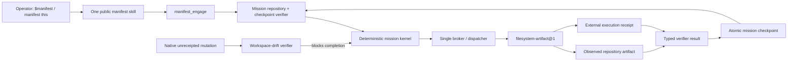

# Codex-first `manifest` live-engagement alpha — design

**Date:** 2026-08-08

**Status:** draft for operator review

**Branch:** `codex/manifest-live-engagement`

**Related design:** `2026-08-08-mission-os-and-manifest-v1-design.md`

**Related review:** [PR #6](https://github.com/ZMS-Labs/practical-agency/pull/6)
at exact observed head `06b0347458c9886b10351e64a0ad0ab786a78bcd`

## Decision

Build the first operator-usable Practical Agency path as one installable Codex
plugin containing:

- the one public `manifest` skill; and
- a bundled, task-scoped stdio MCP controller exposing structured internal
  mission operations.

The public skill is the invocation and stewardship policy. The MCP controller
is the executable path into the deterministic kernel. The controller owns
pathless mission engagement, durable state transitions, authorization, brokered
effects, observation, and checkpointing. It is launched on demand by Codex and
is not a daemon, scheduler, monitor, or independent persistence provider.

This alpha will not claim that installing a plugin removes Codex's native file
or shell tools. Instead, it makes bypass detectable: a mission cannot complete
while workspace changes exist that are not bound to broker-issued execution
receipts. Literal host-level non-bypassability remains a later controlled-agent
runtime problem.

## Why this is the next build

The deterministic kernel now demonstrates a bounded filesystem effect,
one-use broker grants, typed artifact verification, durable checkpoints,
process death, pathless resume, planted-drift detection, repair, and third-
process verification. That is meaningful substrate, but it is not yet an
operator-facing product path.

Current live facts establish the remaining gap:

- `skills/manifest/SKILL.md` is instructions only and does not enter the Python
  controller.
- The required `.codex-plugin/plugin.json` entry point is absent.
- Practical Agency is not present in the installed Codex plugin inventory.
- The existing harness check materializes skill bytes but does not prove tool
  invocation, controller engagement, or effect mediation.
- `status` and effect CLI operations still require a caller-supplied mission
  directory.
- PR #6 is an open draft on a different history from the current local branch;
  it is not merged and contains no review comments at the observed head.
- No Docker or Podman executable is available on the development host, so a
  generic command runner cannot truthfully be described as sandboxed.

OpenAI's plugin architecture explicitly supports combining skills with an MCP
server when workflow guidance needs controlled, structured capabilities. A
Codex plugin requires `.codex-plugin/plugin.json`; bundled MCP servers are
declared through `.mcp.json`; local marketplaces install a cache copy that must
be tested independently of source. See the official
[plugin architecture](https://developers.openai.com/plugins/concepts/plugins)
and [packaging documentation](https://developers.openai.com/plugins/build/plugins).

## Goal

After this alpha is installed, a new Codex task in a repository can invoke
`$manifest` or express equivalent natural-language intent and receive real
mission engagement without supplying a mission path or invoking a CLI.

That engagement must:

1. discover and validate exactly one active mission, or create a draft from the
   operator's verbatim instruction;
2. resume only from a durable checkpoint and re-observe live state;
3. route each supported world effect through one broker/dispatcher;
4. bind each completed effect to an external receipt and typed verifier result;
5. detect and block completion on unreceipted workspace drift;
6. preserve process-interruption recovery and exact mission bindings;
7. label acceptance assurance honestly; and
8. leave an exact source-to-installed provenance receipt plus first-use
   telemetry.

`/manifest` remains the desired human shorthand. The alpha acceptance oracle is
the harness-supported explicit skill form (`$manifest`) plus the natural phrase
`manifest this`. A literal slash-command alias is claimed only if a live Codex
task actually discovers and invokes it.

## Non-goals and claim ceiling

- No second public skill.
- No daemon, scheduler, background worker, or resident coordinator.
- No arbitrary shell, Python, npm, Git, or executable adapter.
- No claim that Codex native tools are removed or technically inaccessible.
- No container-sandbox claim while no real container substrate is available.
- No automatic acceptance claim from process separation alone.
- No ChatGPT, Claude, Cursor, or other harness parity in this alpha.
- No broad workflow-capability inventory or stage-to-skill router.
- No UI, public release, tag, PR merge, or v1-readiness claim.
- No proof yet that the product improves outcomes across many missions.

The supported effect surface is UTF-8 repository artifact creation or
replacement under an explicit path allowlist and expected-before-state guard.
This is useful for durable documents, configuration, source text, and other
bounded artifacts, but it does not prove arbitrary software work correct.

## Alternatives considered

### A. Skill plus CLI

The skill could instruct the model to invoke `python -m practical_agency`.
This is the smallest packaging change, but the model still translates prose
into process arguments, current commands require mission paths, and the host
receives no structured mission tool contract. It would improve convenience,
not establish an executable control plane.

**Decision:** reject as the primary path. Retain the CLI only as a diagnostic
and compatibility surface.

### B. Skill plus bundled stdio MCP controller

The skill triggers a small local MCP server that validates structured inputs
and calls the existing kernel directly. Codex can install both pieces as one
plugin, expose typed tools, apply per-tool approval policy, and launch the
server only for the task.

**Decision:** selected. It is the smallest architecture that converts the
skill from doctrine into a live, testable engagement path without introducing
a service or arbitrary execution.

### C. Constrained child-agent runtime

A parent could launch a worker whose only effect tools are Practical Agency
tools. That is the route to literal non-bypassability because the worker would
not possess native mutation tools. It requires a second agent runtime, a
credential/cost boundary, robust event forwarding, and a real OS/container
sandbox for any generic execution.

**Decision:** defer. Reconsider only after the MCP alpha demonstrates repeat
usefulness or when host-level prevention becomes a release requirement.

## Architecture



### Package boundary

The repository root becomes a valid Codex plugin root:

```text
.codex-plugin/plugin.json   required plugin entry point
.mcp.json                   bundled task-scoped MCP server declaration
skills/manifest/SKILL.md    only public skill
practical_agency/           deterministic kernel and MCP bridge
```

The Codex manifest points `skills` to `./skills/` and `mcpServers` to
`./.mcp.json`. The implementation must use a package-relative launch mechanism
that works from the installed cache copy. It must not embed a developer machine
path. Launcher behavior is verified in an installed plugin before being
documented as supported.

The repo also provides a local marketplace entry for development. Installation
is a mutation of user Codex configuration and cache, so it happens only during
the explicit UAT step. Source and cache copies are separate proof subjects.

### Controller boundary

The MCP bridge is thin. It parses protocol messages, validates tool schemas,
calls public controller functions, and returns typed results. Mission policy,
state transitions, broker grants, adapter semantics, and verifier rules remain
in the kernel rather than being duplicated in MCP handlers.

The initial internal tool surface is:

| Tool | Effect class | Responsibility |
| --- | --- | --- |
| `manifest_engage` | read/control-state | Resolve workspace, discover exactly one unfinished mission, validate the latest checkpoint, capture/reload the durable workspace baseline, reconcile live state, and return the frontier. |
| `manifest_define` | mission-state only | Create a draft from the verbatim instruction and explicit desired state, proof, authority, protected state, stop conditions, and acceptance declaration. |
| `manifest_authorize` | mission-state only | Record an explicit operator authority event; never infer approval from a draft or tool availability. |
| `manifest_dispatch` | world effect | The sole MCP path to an adapter. Coordinate one bounded request, issue a one-use grant, execute, observe, record the receipt and typed verifier result, and checkpoint atomically. |
| `manifest_verify` | read/control-state | Re-observe receipts, artifact bindings, baseline/delta scope, and completion proof; transition to `verifying` only when all checks permit it. |
| `manifest_accept` | mission-state only | Record a verdict with actor and assurance metadata; reject steward self-acceptance and unsupported assurance claims. |

These are internal mission operations, not public skills and not an inventory of
epistemic or workflow capabilities.

### Invocation contract

On a non-routine invocation, the skill calls `manifest_engage` before proposing
or performing mission work. The operator is never asked for a mission path or
mission id.

`manifest_engage` receives the current workspace root from the Codex harness,
not from the operator. It applies these closed outcomes:

- exactly one valid unfinished mission: resume it;
- no unfinished mission and no definition: return
  `MISSION_DEFINITION_REQUIRED` with the required typed fields;
- no unfinished mission and a supplied definition: create one draft and
  checkpoint it;
- multiple unfinished missions: refuse with `ACTIVE_MISSION_AMBIGUOUS` and
  list ids only;
- invalid checkpoint or receipt: refuse with the existing exact integrity code;
- terminal missions only: treat the workspace as having no active mission.

The skill may help the model propose definition fields, but it may not alter
the verbatim instruction, infer authority, or silently choose among active
missions.

### Durable baseline and bypass detection

At activation, the controller records a canonical workspace baseline in the
mission checkpoint. The baseline includes relevant repository-relative paths,
object type, size, and SHA-256, while excluding the mission's own checkpoints,
receipts, and explicitly ignored volatile paths. Existing dirty user work is
therefore protected as starting state rather than misclassified as a mission
effect.

Every broker receipt records the exact before and after binding for each
affected path. Before verification or acceptance, the controller computes the
live delta from the durable baseline and subtracts receipt-authorized effects.
Any remainder yields typed verifier status `contradicted` with reason
`UNRECEIPTED_WORKSPACE_DRIFT`. The mission remains active or returns from
`verifying`; it cannot complete until the drift is reconciled by an explicit
authority decision.

This establishes completion-gated mediation and bypass evidence. It does not
establish host-level prevention.

### Brokered repository artifact effect

`filesystem-artifact@1` remains the sole production effect adapter in this
alpha. It gains only what live repository use requires:

- separate artifact root and receipt root;
- repository-relative allowlisted paths;
- UTF-8 `write-text` only;
- expected-before state (`absent` or SHA-256) to prevent blind overwrite;
- request binding to mission id, mission revision, request id, adapter id, and
  intended effect;
- atomic write and crash-visible journal semantics;
- one-use in-memory broker grant consumed before any effect or receipt
  preparation; and
- post-write observation producing a typed verifier result bound to the actual
  bytes and external receipt.

The adapter remains importable for testing, but direct production dispatch
without an unforgeable current broker grant fails before touching either the
artifact or receipt store. MCP exposes no adapter-specific tool.

### Verification without generic execution

The alpha verifies artifact identity, receipt integrity, request/mission
bindings, checkpoint integrity, scope delta, and state-machine gates. It does
not execute project test commands.

If a mission's completion proof requires Python, npm, Git, compiler, network,
or arbitrary command execution, `manifest_verify` returns
`SANDBOXED_VERIFIER_UNAVAILABLE` unless a future fixed-profile verifier is
running inside a demonstrated OS/container sandbox with explicit resource,
filesystem, network, environment, executable, and argument policy.

An allowlist in the same unsandboxed Windows process is not sufficient and will
not be reintroduced.

### Acceptance

The mission steward cannot accept its own material work. A different process or
actor label without cryptographic or host-provided principal evidence is
recorded as `declared-role-separation`, including that coverage limit.

`externally-proven` remains unavailable until the controller can validate a
principal-evidence receipt issued by a distinct authority boundary. A chat
statement, process id, role string, or model assertion cannot upgrade the
assurance label.

### No-daemon lifecycle

Codex launches the stdio server for an active task. Durable mission state lives
in checkpoints and external receipt files, not server memory. Killing the MCP
process discards all in-memory grants and caches. A new process must call
`manifest_engage`, load the latest valid checkpoint, verify receipts, and
reconcile the workspace before dispatch.

No background continuation claim is made. When the task ends, the server ends.

## Named refusal surface

Existing refusal codes remain stable. The live bridge adds only codes required
at the new boundary:

- `MISSION_DEFINITION_REQUIRED`
- `WORKSPACE_ROOT_INVALID`
- `ACTIVE_MISSION_NOT_FOUND`
- `ACTIVE_MISSION_AMBIGUOUS`
- `INSTALL_PROVENANCE_MISMATCH`
- `EXPECTED_BEFORE_STATE_MISMATCH`
- `UNRECEIPTED_WORKSPACE_DRIFT`
- `SANDBOXED_VERIFIER_UNAVAILABLE`
- `MCP_PROTOCOL_ERROR`

Unsupported operations fail closed. Protocol exceptions return structured
errors and do not advance the mission revision.

## First dogfood mission

After bootstrap packaging and installation, a fresh Codex task will use
`$manifest` to make one useful, bounded source-tree text change in this
repository through `filesystem-artifact@1`. The exact target is selected from a
real remaining documentation or configuration need at execution time; it is not
a throwaway fixture.

The run must then:

1. checkpoint the brokered effect and external receipt;
2. terminate the first controller process;
3. start a new process with no mission path or in-memory state;
4. discover the active mission from the workspace;
5. plant an out-of-band mutation in the governed path;
6. detect `UNRECEIPTED_WORKSPACE_DRIFT` or the more specific artifact-hash
   contradiction;
7. restore the intended bytes through the broker;
8. have a third process verify the checkpoint, receipt, mission/request
   bindings, and live artifact;
9. record acceptance as `declared-role-separation` unless real principal
   evidence is available; and
10. retain an engagement report with duration, calls, revisions, interruption,
    refusal codes, and final claim ceiling.

The proof may update PR #6 or a successor branch only after exact-head
comparison. It must not merge the PR.

## Verification strategy

Implementation follows test-driven development.

### Unit and integration tests

- Failing tests first for every new behavior.
- MCP initialize, tool listing, schema validation, tool calls, and structured
  errors over real stdio pipes.
- Pathless create/resume and ambiguous/invalid mission refusals.
- Durable baseline round-trip and pre-existing dirty-state protection.
- Direct adapter bypass rejected before artifact or receipt mutation.
- Expected-before mismatch and unreceipted-drift completion block.
- External receipt and typed verifier binding to mission revision and request.
- Process death clears grants; resumed process revalidates durable state.
- Acceptance assurance downgrade and steward self-acceptance rejection.
- Generic command requests rejected with
  `SANDBOXED_VERIFIER_UNAVAILABLE`.

### Package and install tests

- Exactly one public `SKILL.md` remains.
- `.codex-plugin/plugin.json` and `.mcp.json` validate and use only relative,
  public paths.
- A local marketplace can discover and install the plugin with Codex CLI
  `0.146.0` or the then-current observed version.
- Installed cache files match the intended source tree by a canonical manifest
  of SHA-256 values.
- The installed MCP server starts from the cache copy and lists the expected
  tools.
- Source-only success does not satisfy installation acceptance.

### Fresh-task UAT

A new Codex task, or a fresh non-interactive Codex process when it exercises the
same plugin discovery surface, must record:

- selected plugin and skill;
- exact invocation text;
- first controller tool called;
- mission id and checkpoint revision returned;
- dispatched request and external receipt reference;
- interruption/resume evidence;
- planted-drift verifier result;
- third-process verification; and
- source/install provenance hashes.

The explicit `$manifest` form and natural phrase are separate cases. Literal
`/manifest` is reported as observed, unsupported, or not tested—never assumed.

### Existing required checks

The full suite and repository checks remain mandatory:

```text
python -m unittest discover -s tests -p 'test_*.py' -v
python -m compileall -q practical_agency tests
python .github/scripts/check_contracts.py
python .github/scripts/check_package.py
python .github/scripts/check_public_content.py
```

## Success criteria

The alpha is complete only when all of the following are observed:

- Practical Agency is installed and enabled as a Codex plugin from an exact
  source revision or working-tree manifest.
- A fresh task discovers the one public `manifest` skill.
- Invocation enters the bundled controller before mission work.
- The operator supplies no mission path or mission id.
- A real repository text effect is brokered, receipted, observed, and
  checkpointed.
- A dead controller process is replaced; the replacement resumes solely from
  durable state.
- Planted drift is detected and prevents false completion.
- A third process verifies the external receipt and mission/request bindings.
- Acceptance assurance is truthful.
- No generic execution adapter, daemon, second public skill, or merge is added.
- Required checks pass at the exact final working-tree fingerprint.

## Value test and stopping rule

This alpha proves that `/manifest`-equivalent intent can enter a real mission
control path and preserve work across interruption. It does not prove that the
ceremony is worth its cost.

For the first dogfood run, retain:

- time to first authorized action;
- number of operator clarifications and approvals;
- number of checkpoints and resumptions;
- false-completion defects prevented;
- unreceipted changes detected;
- recovery time after interruption; and
- additional mission overhead compared with doing the bounded change directly.

If the path does not prevent a real error, recover useful state, or make the
work materially easier to trust, stop expanding architecture and simplify the
engagement contract before adding adapters or harnesses.
